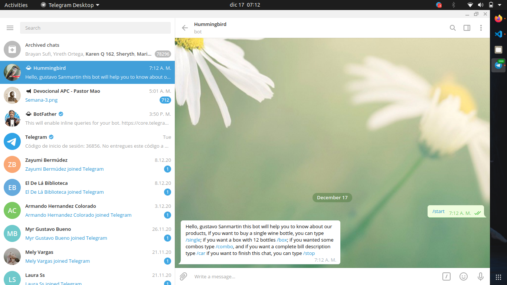
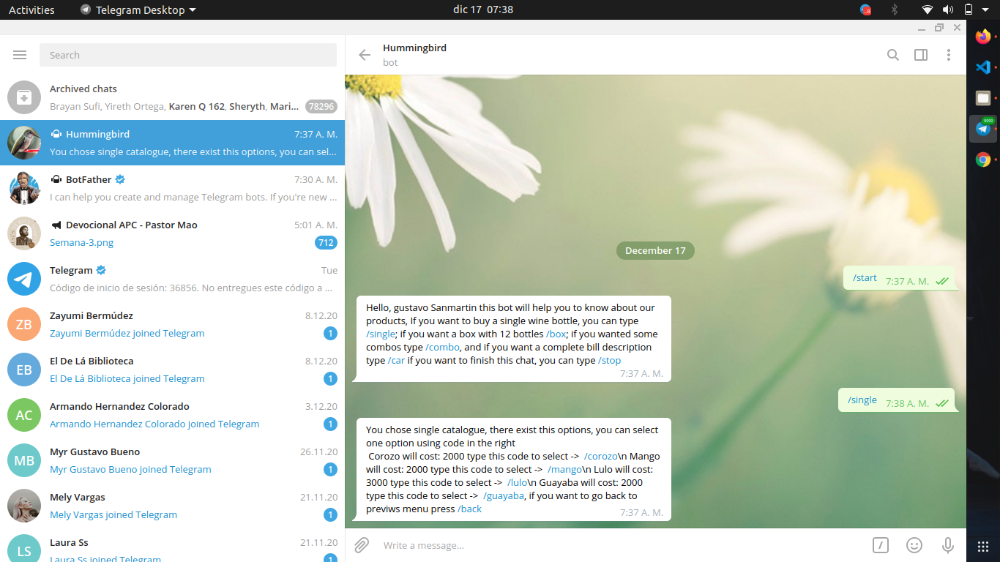
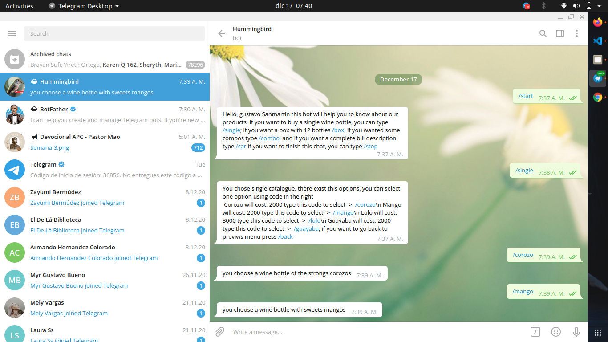
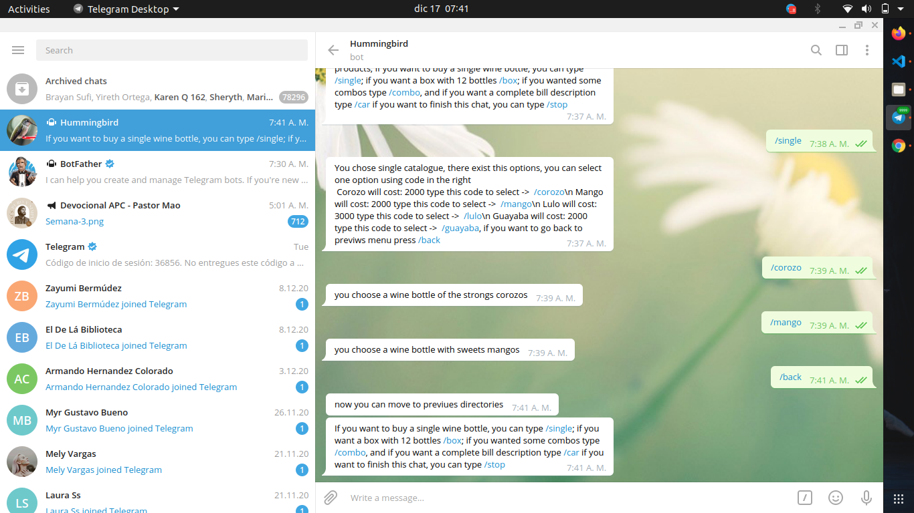
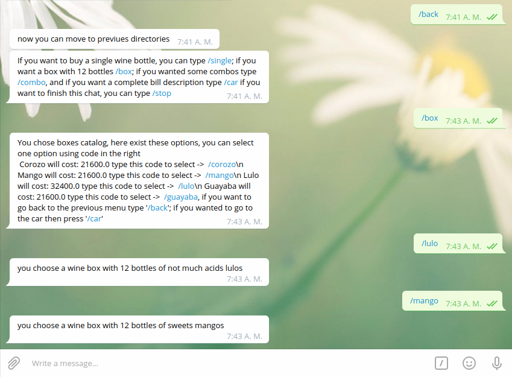
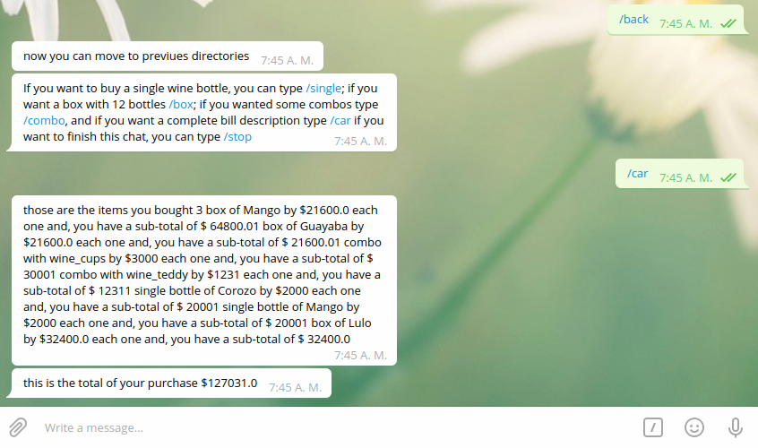
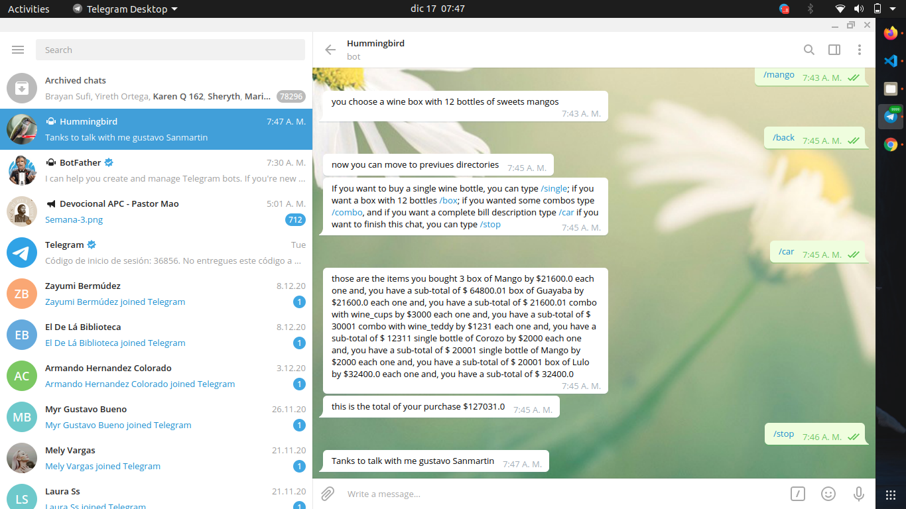

# Hummingbird Bot

In this project, I made a bot to help clients have a quotation for a wine sale.



In this project, I make a Telegram wine quote bot using the API given by the BotFather from telegram.
# Descrition
With this bot: 
you can move within options, using the assigned typings. 
you can choose different flavors for  single bottles, boxes with 12 bottles of wine each one and/or take combos.
## Group Link

> <a href=http://t.me/JuanDlaCruzbot>Group link</a>

## :video_camera: Video Description

> Here you can see the video description: <a href="https://www.loom.com/share/f2bf2bb1e041459e854d73e095e308b1">Video</a>

## :computer: Built With

- Ruby
- Ruby gem Telegram-bot
- Ruby gem Rspec
- Ruby gem bundle
- VSCode
- Rubocop
  
## :wrench: Getting Started
> Take a copy of this project locally

- Go to the main page of the repo.
- Press the "Code" button and get the repo link.
- Clone it using git clone. 
```
git clone 'repo_link' 
```

## :green_book: How to use

- After you clone the repo, use
```
bundle install
```
- and for run
```
bundle exec ruby /bin/main.rb
```
- now open your telegram and search to @JuanDlaCruzbot or use this <a href=http://t.me/JuanDlaCruzbot>Direct link</a>
- With this bot: 
- you can move within options, using the assigned typings. 

- if you choose single bottles 

```
/single
```

- you will watch different flavor options; if you want something like "corozo" type 

```
/corozo
```
- You can keep choosing any flavor.

- But if you want to select a box with 12 bottles of wine, you have to move to the previous menu

```
/back
```



- And now choose a box or two.

- Also, you can go and take one combo 
```
  /combo,
```
-  going back to the last menu.

When you feel you don't want to buy anything, go to your car 
```
/car
``` 
and see how much you expect to spend.

Now you know how you will spend; you can keep going, have to choose an option 
```
/single, /box or /combo
```
 but if you want to stop, try typing 
 ```
 "/stop."
 ```
 


## :man: Authors

:bird: **Gustavo Sanmartin**

- GitHub: [@gasb150](https://github.com/gasb150)
- Twitter: [@7aves](https://twitter.com/7aves)
- LinkedIn: [Gutavo Sanmartin](https://www.linkedin.com/in/gustavo-sanmartin-b3b68261/)

## :clap: Acknowledgments

- [Microverse](https://www.microverse.org/)
- [The Odin Project](https://www.theodinproject.com)
- [Telegram](https://web.telegram.org/)

## Show your support

<p> Give a 
  <g-emoji class="g-emoji" alias="star" fallback-src="https://github.githubassets.com/images/icons/emoji/unicode/2b50.png"></g-emoji>
  if you like this project!</p>


## License
  <p>This project is <a href="../feature/LICENSE">MIT</a> licensed.</p>